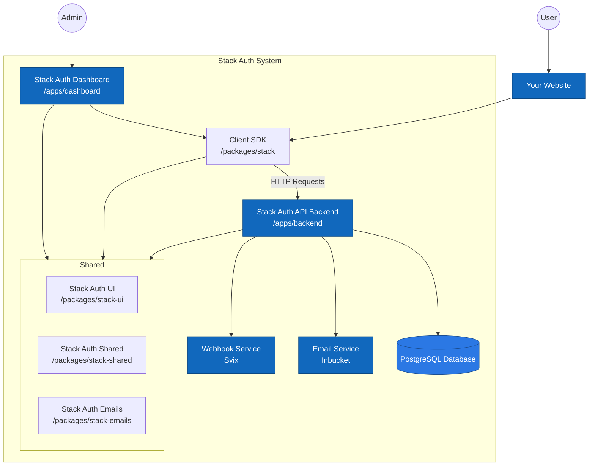

[](https://stack-auth.com)

<h3 align="center">
  <a href="https://docs.stack-auth.com">📘 Docs</a>
  | <a href="https://stack-auth.com/">☁️ Hosted Version</a>
  | <a href="https://demo.stack-auth.com/">✨ Demo</a>
  | <a href="https://discord.stack-auth.com">🎮 Discord</a>
</h4>

# Stack Auth: The open-source auth platform

Stack Auth is a managed user authentication solution. It is developer-friendly and fully open-source (licensed under MIT and AGPL).

Stack Auth gets you started in just five minutes, after which you'll be ready to use all of its features as you grow your project. Our managed service is completely optional and you can export your user data and self-host, for free, at any time.

We support Next.js, React, and JavaScript frontends, along with any backend that can use our [REST API](https://docs.stack-auth.com/api/overview). Check out our [setup guide](https://docs.stack-auth.com/docs/next/getting-started/setup) to get started.

<div align="center">

</div>

## Table of contents

<!-- START doctoc generated TOC please keep comment here to allow auto update -->
<!-- DON'T EDIT THIS SECTION, INSTEAD RE-RUN doctoc TO UPDATE -->

- [How is this different from X?](#how-is-this-different-from-x)
- [✨ Features](#-features)
- [📦 Installation & Setup](#-installation--setup)
- [🌱 Some community projects built with Stack Auth](#-some-community-projects-built-with-stack-auth)
  - [Templates](#templates)
  - [Examples](#examples)
- [🏗 Development & Contribution](#-development--contribution)
  - [Requirements](#requirements)
  - [Setup](#setup)
  - [Useful commands](#useful-commands)
  - [Chat with the codebase](#chat-with-the-codebase)
  - [Architecture overview](#architecture-overview)
- [❤ Contributors](#-contributors)

<!-- END doctoc generated TOC please keep comment here to allow auto update -->

## How is this different from X?

Ask yourself about `X`:

- Is `X` open-source?
- Is `X` developer-friendly, well-documented, and lets you get started in minutes?
- Besides authentication, does `X` also do authorization and user management (see feature list below)?

If you answered "no" to any of these questions, then that's how Stack Auth is different from `X`.

## ✨ Features

To get notified first when we add new features, please subscribe to [our newsletter](https://stack-auth.beehiiv.com/subscribe).

| | |
|-|:-:|
| <h3>`<SignIn/>` and `<SignUp/>`</h3> Authentication components that support OAuth, password credentials, and magic links, with shared development keys to make setup faster. All components support dark/light modes. |  |
| <h3>Idiomatic Next.js APIs</h3> We build on server components, React hooks, and route handlers. |  |
| <h3>User dashboard</h3> Dashboard to filter, analyze, and edit users. Replaces the first internal tool you would have to build. |  |
| <h3>Account settings</h3> Lets users update their profile, verify their e-mail, or change their password. No setup required. |  |
| <h3>Multi-tenancy & teams</h3> Manage B2B customers with an organization structure that makes sense and scales to millions. |  |
| <h3>Role-based access control</h3> Define an arbitrary permission graph and assign it to users. Organizations can create org-specific roles. |  |
| <h3>OAuth Connections</h3>Beyond login, Stack Auth can also manage access tokens for third-party APIs, such as Outlook and Google Calendar. It handles refreshing tokens and controlling scope, making access tokens accessible via a single function call. |  |
| <h3>Passkeys</h3> Support for passwordless authentication using passkeys, allowing users to sign in securely with biometrics or security keys across all their devices. |  |
| <h3>Impersonation</h3> Impersonate users for debugging and support, logging into their account as if you were them. |  |
| <h3>Webhooks</h3> Get notified when users use your product, built on Svix. |  |
| <h3>Automatic emails</h3> Send customizable emails on triggers such as sign-up, password reset, and email verification, editable with a WYSIWYG editor. |  |
| <h3>User session & JWT handling</h3> Stack Auth manages refresh and access tokens, JWTs, and cookies, resulting in the best performance at no implementation cost. |  |
| <h3>M2M authentication</h3> Use short-lived access tokens to authenticate your machines to other machines. |  |


## 📦 Installation & Setup

To install Stack Auth in your Next.js project (for React, JavaScript, or other frameworks, see our [complete documentation](https://docs.stack-auth.com)):

1. Run Stack Auth's installation wizard with the following command:
    ```bash
    npx @stackframe/init-stack@latest
    ```
   
   If you prefer not to open a browser during setup (useful for CI/CD environments or restricted environments):
    ```bash
    npx @stackframe/init-stack@latest --no-browser
    ```

2. Then, create an account on the [Stack Auth dashboard](https://app.stack-auth.com/projects), create a new project with an API key, and copy its environment variables into the .env.local file of your Next.js project:
    ```
    NEXT_PUBLIC_STACK_PROJECT_ID=<your-project-id>
    NEXT_PUBLIC_STACK_PUBLISHABLE_CLIENT_KEY=<your-publishable-client-key>
    STACK_SECRET_SERVER_KEY=<your-secret-server-key>
    ```
3. That's it! You can run your app with `npm run dev` and go to [http://localhost:3000/handler/signup](http://localhost:3000/handler/signup) to see the sign-up page. You can also check out the account settings page at [http://localhost:3000/handler/account-settings](http://localhost:3000/handler/account-settings).

Check out the [documentation](https://docs.stack-auth.com/getting-started/setup) for a more detailed guide.

## 🌱 Some community projects built with Stack Auth

Have your own? Happy to feature it if you create a PR or message us on [Discord](https://discord.stack-auth.com).

### Templates
- [Stack Auth Template by Stack Auth Team](https://github.com/stack-auth/stack-auth-template)
- [Next SaaSkit by wolfgunblood](https://github.com/wolfgunblood/nextjs-saaskit)
- [SaaS Boilerplate by Robin Faraj](https://github.com/robinfaraj/saas-boilerplate)

### Examples
- [Stack Auth Example by career-tokens](https://github.com/career-tokens/StackYCAuth)
- [Stack Auth Demo by the Stack Auth team](https://github.com/stack-auth/stack-auth/tree/dev/examples/demo)
- [Stack Auth E-Commerce Example by the Stack Auth team](https://github.com/stack-auth/stack-auth/tree/dev/examples/e-commerce)

## 🏗 Development & Contribution

This is for you if you want to contribute to the Stack Auth project or run the Stack Auth dashboard locally.

**Important**: Please read the [contribution guidelines](CONTRIBUTING.md) carefully and join [our Discord](https://discord.stack-auth.com) if you'd like to help.

### Requirements

- Node v20
- pnpm v9
- Docker

### Setup

Note: 24GB+ of RAM is recommended for a smooth development experience.

In a new terminal:

```sh
pnpm install

# Build the packages and generate code. We only need to do this once, as `pnpm dev` will do this from now on
pnpm build:packages
pnpm codegen

# Start the dependencies (DB, Inbucket, etc.) as Docker containers, seeding the DB with the Prisma schema
# Make sure you have Docker (or OrbStack) installed and running
pnpm restart-deps

# Start the dev server
pnpm dev

# In a different terminal, run tests in watch mode
pnpm test
```

You can now open the dev launchpad at [http://localhost:8100](http://localhost:8100). From there, you can navigate to the dashboard at [http://localhost:8101](http://localhost:8101), API on port 8102, demo on port 8103, docs on port 8104, Inbucket (e-mails) on port 8105, and Prisma Studio on port 8106. See the dev launchpad for a list of all running services.

Your IDE may show an error on all `@stackframe/XYZ` imports. To fix this, simply restart the TypeScript language server; for example, in VSCode you can open the command palette (Ctrl+Shift+P) and run `Developer: Reload Window` or `TypeScript: Restart TS server`.

Pre-populated .env files for the setup below are available and used by default in `.env.development` in each of the packages. However, if you're creating a production build (eg. with `pnpm run build`), you must supply the environment variables manually (see below).

### Useful commands

```sh
# NOTE:
# Please see the dev launchpad (default: http://localhost:8100) for a list of all running services.

# Installation commands
pnpm install: Installs dependencies

# Types & linting commands
pnpm typecheck: Runs the TypeScript type checker. May require a build or dev server to run first.
pnpm lint: Runs the ESLint linter. Optionally, pass `--fix` to fix some of the linting errors. May require a build or dev server to run first.

# Build commands
pnpm build: Builds all projects, including apps, packages, examples, and docs. Also runs code-generation tasks. Before you can run this, you will have to copy all `.env.development` files in the folders to `.env.production.local` or set the environment variables manually.
pnpm build:packages: Builds all the npm packages.
pnpm codegen: Runs all the code-generation tasks, eg. Prisma client and OpenAPI docs generation.

# Development commands
pnpm dev: Runs the development servers of the main projects, excluding most examples. On the first run, requires the packages to be built and codegen to be run. After that, it will watch for file changes (including those in code-generation files). If you have to restart the development server for anything, that is a bug that you can report.
pnpm dev:full: Runs the development servers for all projects, including examples.
pnpm dev:basic: Runs the development servers only for the necessary services (backend and dashboard). Not recommended for most users, upgrade your machine instead.

# Environment commands
pnpm start-deps: Starts the Docker dependencies (DB, Inbucket, etc.) as Docker containers, and initializes them with the seed script & migrations. Note: The started dependencies will be visible on the dev launchpad (port 8100 by default).
pnpm stop-deps: Stops the Docker dependencies (DB, Inbucket, etc.) and deletes the data on them.
pnpm restart-deps: Stops and starts the dependencies.

# Database commands
pnpm db:migration-gen: Currently not used. Please generate Prisma migrations manually (or with AI).
pnpm db:reset: Resets the database to the initial state. Run automatically by `pnpm start-deps`.
pnpm db:init: Initializes the database with the seed script & migrations. Run automatically by `pnpm db:reset`.
pnpm db:seed: Re-seeds the database with the seed script. Run automatically by `pnpm db:init`.
pnpm db:migrate: Runs the migrations. Run automatically by `pnpm db:init`.

# Testing commands
pnpm test <file-filters>: Runs the tests. Pass `--bail 1` to make the test only run until the first failure. Pass `--no-watch` to run the tests once instead of in watch mode.

# Various commands
pnpm explain-query: Paste a SQL query to get an explanation of the query plan, helping you debug performance issues.
pnpm verify-data-integrity: Verify the integrity of the data in the database by running a bunch of integrity checks. This should never fail at any point in time (unless you messed with the DB manually).
```

Note: When working with AI, you should keep a terminal tab with the dev server open so the AI can run queries against it.

### Chat with the codebase

Storia trained an [AI on our codebase](https://sage.storia.ai/stack-auth) that can answer questions about using and contributing to Stack Auth.

### Architecture overview



Thanks to [CodeViz](https://www.codeviz.ai) for generating the diagram!

## ❤ Contributors

<a href="https://github.com/stack-auth/stack-auth/graphs/contributors">
  
</a>
