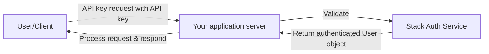

API keys provide a secure way for your users to authenticate with your application's backend. 
They enable programmatic access to your API services, allowing developers to associate requests with specific users or teams.
Stack Auth provides prebuilt UI components for the users and teams to manage their own API keys.

## Overview

API keys allow your users to access your backend services programmatically. 



Stack Auth provides two types of API keys:

### User API keys

User API keys are associated with individual users and allow them to authenticate with your API.

<Tabs>
  <Tab title="Client">
    ```typescript
    const user = await stackApp.getUser();
    
    const apiKey = await user.createApiKey({
      description: "My client application",
      expiresAt: new Date(Date.now() + (90 * 24 * 60 * 60 * 1000)), // 90 days
      isPublic: false,
    });
    ```
  </Tab>
  <Tab title="Server">
    ```typescript
    const user = await stackServerApp.getServerUserById("user-id-here");
    
    const apiKey = await user.createApiKey({
      description: "Admin-provisioned API key",
      expiresAt: new Date(Date.now() + (30 * 24 * 60 * 60 * 1000)), // 30 days
      isPublic: false,
    });
    ```
  </Tab>
</Tabs>

### Team API keys

Team API keys are associated with teams and can be used to provide access to team resources over your API.

<Tabs>
  <Tab title="Client">
    ```typescript
    const user = await stackApp.getUser();
    const team = await user.getTeam("team-id-here");
    
    const teamApiKey = await team.createApiKey({
      description: "Team integration service",
      expiresAt: new Date(Date.now() + (60 * 24 * 60 * 60 * 1000)), // 60 days
      isPublic: false,
    });
    ```
  </Tab>
  <Tab title="Server">
    ```typescript
    const team = await stackServerApp.getTeam("team-id-here");
    
    const teamApiKey = await team.createApiKey({
      description: "Admin-provisioned team API key",
      expiresAt: new Date(Date.now() + (30 * 24 * 60 * 60 * 1000)), // 30 days
      isPublic: false,
    });
    ```
  </Tab>
</Tabs>

## Setting Up API Keys in Stack Auth

To use API keys in your application, you need to enable them in your project settings. Navigate to the Stack Auth dashboard, select your project, and enable User API Keys and/or Team API Keys in the project settings.

## Working with API Keys

### Creating User API Keys

<Tabs>
  <Tab title="Client">
    ```typescript
    const apiKey = await user.createApiKey({
      description: "Development environment key",
      expiresAt: new Date(Date.now() + (90 * 24 * 60 * 60 * 1000)), // 90 days from now
      isPublic: false,
    });
    ```
  </Tab>
  <Tab title="Server">
    ```typescript
    const userId = "user-id-here";
    const user = await stackServerApp.getServerUserById(userId);
    
    const apiKey = await user.createApiKey({
      description: "API key created by server",
      expiresAt: new Date(Date.now() + (90 * 24 * 60 * 60 * 1000)), // 90 days
      isPublic: false,
    });
    ```
  </Tab>
</Tabs>

### Creating Team API Keys

<Tabs>
  <Tab title="Client">
    ```typescript
    const team = await user.getTeam("team-id-here");
    
    const teamApiKey = await team.createApiKey({
      description: "Team service integration",
      expiresAt: new Date(Date.now() + (60 * 24 * 60 * 60 * 1000)), // 60 days
      isPublic: false,
    });
    ```
  </Tab>
  <Tab title="Server">
    ```typescript
    const team = await stackServerApp.getTeam("team-id-here");
    
    const teamApiKey = await team.createApiKey({
      description: "Server-created team API key",
      expiresAt: new Date(Date.now() + (60 * 24 * 60 * 60 * 1000)), // 60 days
      isPublic: false,
    });
    ```
  </Tab>
</Tabs>

### Listing API Keys

<Tabs>
  <Tab title="Client">
    ```typescript
    // List user's API keys
    const userApiKeys = await user.listApiKeys();
    
    // List a team's API keys
    const team = await user.getTeam("team-id-here");
    const teamApiKeys = await team.listApiKeys();
    
    // Using hooks in React components
    const apiKeys = user.useApiKeys();
    const teamApiKeys = team.useApiKeys();
    ```
  </Tab>
  <Tab title="Server">
    ```typescript
    // List a specific user's API keys
    const user = await stackServerApp.getServerUserById("user-id-here");
    const userApiKeys = await user.listApiKeys();
    
    // List a team's API keys
    const team = await stackServerApp.getTeam("team-id-here");
    const teamApiKeys = await team.listApiKeys();
    ```
  </Tab>
</Tabs>

### Revoking API Keys

API keys can be revoked when they are no longer needed or if they have been compromised.

<Tabs>
  <Tab title="Client">
    ```typescript
    const apiKeys = await user.listApiKeys();
    const apiKeyToRevoke = apiKeys.find(key => key.id === "api-key-id-here");
    
    if (apiKeyToRevoke) {
      await apiKeyToRevoke.revoke();
    }
    ```
  </Tab>
  <Tab title="Server">
    ```typescript
    const user = await stackServerApp.getServerUserById("user-id-here");
    const apiKeys = await user.listApiKeys();
    
    const apiKeyToRevoke = apiKeys.find(key => key.id === "api-key-id-here");
    
    if (apiKeyToRevoke) {
      await apiKeyToRevoke.revoke();
    }
    ```
  </Tab>
</Tabs>

### Checking API Key Validity

You can check if an API key is still valid:

```typescript
const apiKeys = await user.listApiKeys();
const apiKey = apiKeys.find(key => key.id === "api-key-id-here");

if (apiKey && apiKey.isValid()) {
  // API key is valid
} else {
  // API key is invalid (expired or revoked)
  const reason = apiKey ? apiKey.whyInvalid() : "not found";
  console.log(`API key is invalid: ${reason}`);
}
```
